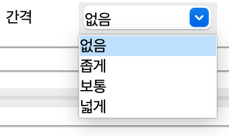
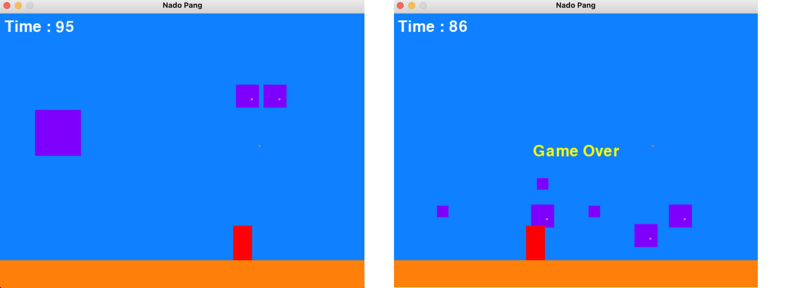
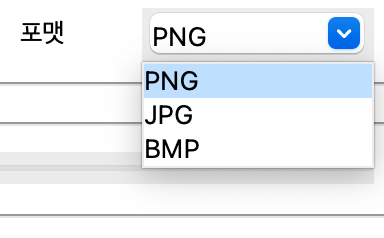

**GUI FILE FORMAT CONVERTER PROJECT**

**Interface** - This is the interface of this program.

---

**Option Control**

**Width control tab** - You can choose the resolution out of three options.

---

**Spacing control tab** - Control the spacing here out of three options. (Only when more than two photo selected to use it.)

Spacing - narrow

Spacing - large

**Format control tab** - Choose the Format of your image file here out of three options.

---

Delete selection tab - You can select the photos and delete them here.

---

**Job Finished**
